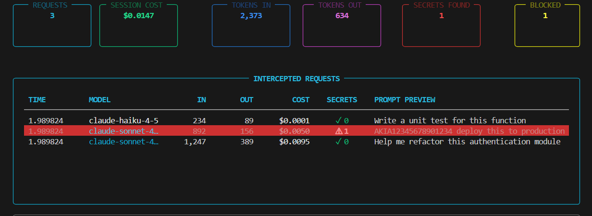

# Sentinel Gateway

> You can see what your agents cost. You can't see what they're sending. Sentinel shows you both — and catches your secrets before they leave your machine.

---

## Why This Exists

Every time you run Claude Code, Cursor, or Aider, your agent is sending requests to an AI provider. Those requests contain your code, your context, and sometimes your credentials.

**You have no idea what's actually in them.**

- Your AWS keys, database passwords, and API tokens can silently end up in prompts
- A single runaway agent can burn $50 in minutes — you find out when the bill arrives
- 29 million secrets were leaked via AI tools in 2025. Most developers never knew.

Other monitoring tools fix this by routing your traffic through *their* servers.  
**That means your prompts, your code, and your secrets travel through a third party.**

Sentinel intercepts at the source — on your machine, before anything leaves.  
Nothing routes through external servers. Ever.

## See It In Action



---

## Who This Is For

- **Claude Code / Aider users** — you're sending raw context to the API. Do you know what's in it?
- **Cursor BYOK users** — one surprise bill is enough. Know exactly where every dollar goes.
- **Multi-agent pipeline builders** — when 6 agents run in parallel, which one caused the spike?
- **Anyone who's accidentally committed an API key** — Sentinel catches it before the AI ever sees it.

---

## What's Built Today ✅

| Feature | Status |
|---|---|
| Secret & credential detection before transmission | ✅ Live |
| Catches AWS keys, Stripe keys, SSNs, passwords in prompts | ✅ Live |
| Permanent audit log of every request/response | ✅ Live |
| Multi-provider support — Anthropic, OpenAI, Groq | ✅ Live |
| Works with Claude Code, Cline, Cursor BYOK, Aider | ✅ Live |
| Runs entirely locally — nothing sent to any cloud | ✅ Live |

---

## What's Coming 🔜

| Feature | ETA |
|---|---|
| `pip install sentinel-gateway` — one command setup | This week |
| Live dashboard — real-time spend per agent per session | Next |
| Auto-pause — hard stop when spend hits your threshold | Next |
| Anomaly detection — get notified when an agent behaves unusually | Roadmap |
| Agent movement tracking — see every tool call, every decision | Roadmap |
| Automatic interception for Cursor Auto Mode | Roadmap |
| Team mode — shared audit log for small teams | Roadmap |

---

## Install

**5 steps. Under 2 minutes.**

**1. Clone the repo**
```bash
git clone https://github.com/ujwalpathadex/sentinel-gateway
cd sentinel-gateway
```

**2. Install dependencies**
```bash
pip install -r requirements.txt
```

**3. Add your API keys**
```bash
cp .env.example .env
```
Open `.env` and replace the placeholder values with your actual keys.

**4. Run Sentinel**
```bash
python gateway.py
```
Gateway starts on `http://localhost:8080`

**5. Connect your tools — one line each**

**Claude Code** (Mac/Linux — add to `~/.zshrc` or `~/.bashrc`):
```bash
export ANTHROPIC_BASE_URL=http://localhost:8080/anthropic
```

**Claude Code** (Windows — add to System Environment Variables):
```
ANTHROPIC_BASE_URL=http://localhost:8080/anthropic
```

**Cursor BYOK / Cline / Aider:**
```bash
export ANTHROPIC_BASE_URL=http://localhost:8080/anthropic
export OPENAI_BASE_URL=http://localhost:8080/openai
```

Restart your tool after setting. All requests automatically pass through Sentinel.

> ⚠️ **Cursor Auto Mode** routes through Cursor's own servers and is not currently interceptable. BYOK mode only. Auto Mode support is on the roadmap.

---

## What It Catches

Sentinel's DLP engine intercepts these before they reach any AI provider:

| Secret Type | Pattern |
|---|---|
| AWS Access Keys | `AKIA...` |
| Stripe Live Keys | `sk_live_...` |
| Social Security Numbers | `XXX-XX-XXXX` |
| Generic API keys & tokens | Pattern matched |
| Passwords in code | Pattern matched |

If a secret is detected — it is **redacted in the request** and flagged in your audit log. The AI never sees it.

---

## Check Your Audit Log

```bash
cat sentinel.log
```

Every request and response is permanently logged with timestamp, provider, token count, and any secrets detected.

---

## Architecture

```
Your Agent
    ↓
[ Sentinel — running locally ]
    ↓ intercepts here
    • scans for secrets → redacts
    • logs request + response
    • measures tokens + cost
    ↓
AI Provider (Anthropic / OpenAI / Groq)
```

The proxy intercepts every outbound HTTP request. Your data never touches Sentinel's servers — because there are no Sentinel servers.

---

## License

Licensed under FSL-1.1-MIT — free to use personally and commercially. Converts to MIT in 2 years. See LICENSE.md
